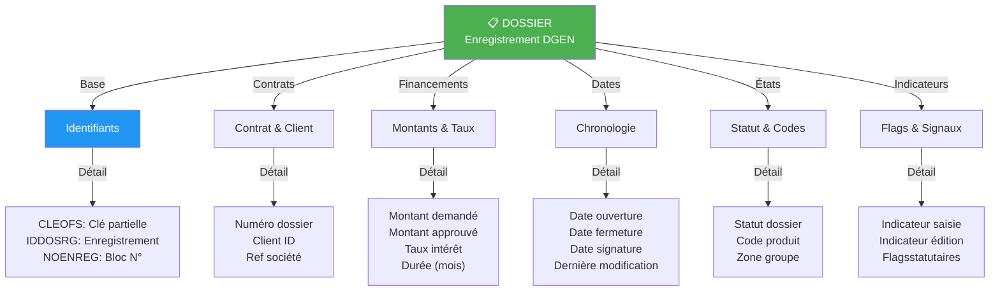
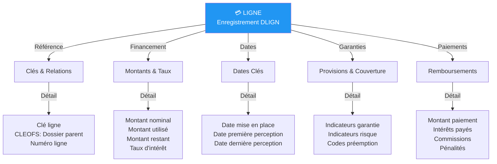
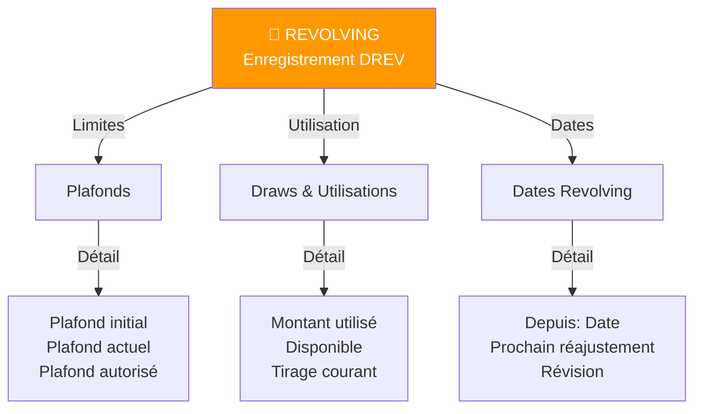
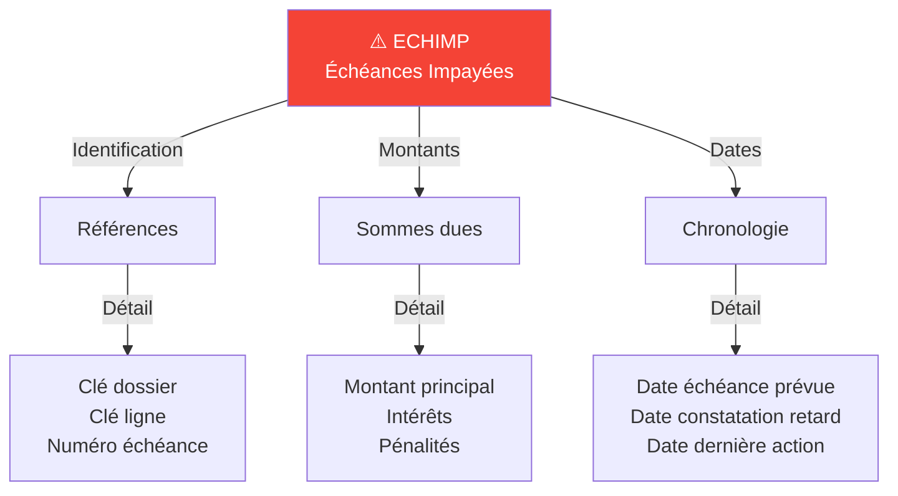
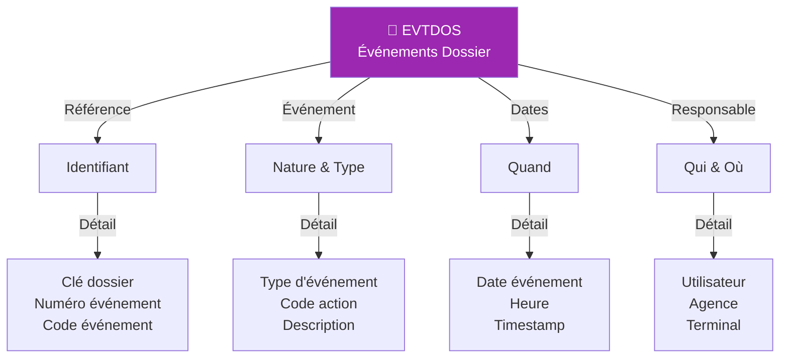
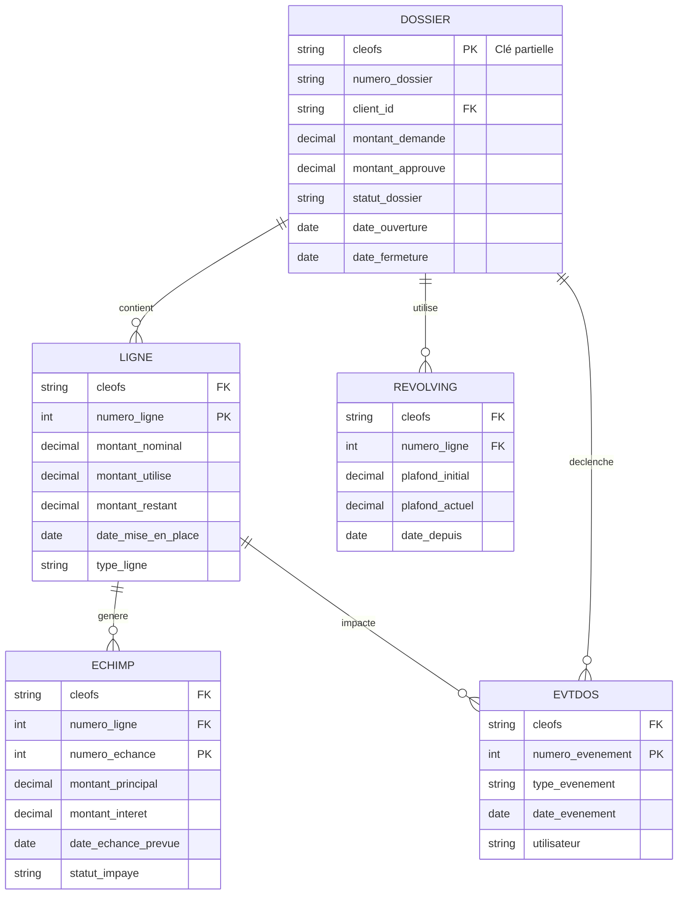
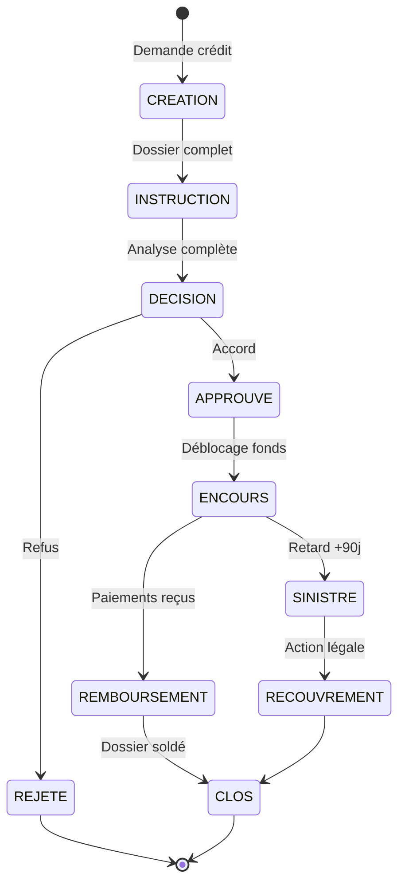

# LS V3.8.0 - Schémas Exacts de Base de Données

Basé sur **LS - V3.8.0 - C.01.02 - Description des prises - Fichiers permanents** (346 pages)

**STRUCTURE DÉTAILLÉE AVEC VRAIS CODES DE CHAMPS ET VALEURS**

## Sommaire des Tables Principales

| Numéro | Table | Code | Description | Pages |
|--------|-------|------|-------------|----- |
| 1 | DOSSIER | ENR-DGEN | Fichier des dossiers de prêt | 4-49 |
| 2 | LIGNE | ENR-DLIGN | Fichier des dossiers de ligne | 53-111 |
| 3 | REVOLVING | ENR-DREV | Fichier des dossiers revolving | 112-137 |
| 4 | ECHIMP | ENR-ECHIMP | Fichier des échéances impayées | 138-148 |
| 5 | EVTDOS | ENR-EVTDOS | Fichier des événements dossier | 149-157 |

---

## 1. Table DOSSIER (DGEN) - Fichier des dossiers de prêt

**Pages: 4-49 | Code: ENR-DGEN**

### Structure: Enregistrements et Zones

DGEN contient 7 enregistrements différents (01-02-38-39-43-44-62) avec zones de données.

### ENREGISTREMENT (01): DONNÉES DE LANCEMENT

**Code Champs Clés:**

| Code | Type | Taille | Description | Valeurs/Exemples |
|------|------|--------|-------------|-------------------|
| CLEOFS | X(27) | 27 | Clé partielle = identifie le dossier | DEI|FRANCE|DOSSIER-001 |
| IDDOSRG | X(5) | 5 | Identifiant de l'enregistrement | O1 (Enregistrement 01) |
| NOENREG | 99(9) | 9 | Numéro d'occurrence du bloc |  |
| NOENREG | 99 | Numéro de jour dans le mois | JJ de la zone DTECH-12 |
| ABRNNAT | 99 | Numéro d'occurrence des zones résultats accessoire à percevoir | groupées par nature |

---

### ENREGISTREMENT (50): RÉSULTATS - CODES STATUS DOSSIER

**Pages: 46 | CRITIQUES POUR LE RAG**

#### CDSITC-22: Code situation comptable du dossier
```
blanc = prêt en situation normale
3 = prêt douteux (si déclaissement manuel)
4 = prêt compromis (si déclaissement manuel)
5 = prêt compromis (si déclaissement automatique)
```
**Classe prêt (Table P039 poste 4-6):** codes prédéfinis pour différents niveaux de risque

#### CDSITDOS-22: Code situation du dossier *** CRITICAL ***
```
1 = dossier accordé en attente de réalisation
2 = dossier en cours d'amortissement
3 = dossier en attente de prise en charge données financières (RAP, blocage)
4 = dossier en attente de reprise
5 = dossier soldé ← C'EST LA VALEUR POUR "DOSSIER SOLDÉ" (NOT 6)
```
**Valeurs possibles:** 1, 2, 3, 4, 5 uniquement (5 valeurs totales)

#### CDMOTIF-22: Code motif solde du dossier
```
0 = dossier solde à blanc
1 = après RAT (crédit amortissable classique)
2 = après passage en contentieux
3 = après passage en continu
et autres codes spécifiques au type de clôture
```

#### INDAMOR-22: Indicateur d'amortissement
```
0 = au départ, on pour un dossier de type 0
1 = à partir de l'échéance où commence la phase de prorogatione, avant le dernier débloc
3 = à partir de l'anticipation de l'échéance ou commence la phase de prorogatione jusqu'à
4 = à partir de la commande de dernier débloc, sans réduction de nominal
5 = à partir de fin d'utilisation attente
6 = après reprise après modif données financières
7 = reprise après modif données financières
8 = blocage
9 = modification date prochaine échéance d'engagement
A = déblocage progressif
B = modification date début du contrat à date future
D = passage à taux indexé, changement d'index
E = report d'échéance
F = passage à taux fixe
```

---

## 2. Table LIGNE (DPAY) - Fichier des dossiers de ligne

**Pages: 53-111 | Code: ENR-DLIGN**

Chaque ligne de crédit associée à un dossier principal. Plusieurs lignes par CLEOFS.

### Champs Clés

### Diagramme DOSSIER



### Exemples de Champs DOSSIER

```
Enregistrement (01) données de lancement:
• CLEOFS (Clé partielle): identifie le dossier de crédit
• IDDOSRG (Enregistrement O1): données de lancement de trésorier
• Indicateur saisie (voir ci-après)
• Zone de groupe : (Commande à date future ou répétitive)
• Date de création du dossier
• Date de dernière traitement périodique
• Date de dernière traitement mensuel ou fin de mois
• Date de dernières déclarations mensuelles
• Numéro d'enregistrement annuel
```

---

## 2. Table LIGNE (DPAY) - Fichier des dossiers de ligne

**Pages: 53-111 | Code: ENR-DLIGN**

Chaque ligne de crédit associée à un dossier principal.



---

## 3. Table REVOLVING (DREV) - Fichier des dossiers revolving

**Pages: 112-137 | Code: ENR-DREV**

Pour lignes de crédit revolving (utilisable sans nouvelle demande).



---

## 4. Table ECHIMP - Échéances Impayées

**Pages: 138-148 | Code: ENR-ECHIMP**

Historique des échéances non payées et retards.



---

## 5. Table EVTDOS - Événements Dossier

**Pages: 149-157 | Code: ENR-EVTDOS**

Journal des événements : modifications, actions, décisions.



---

## Schéma Relationnel Complet



---

## Cycle de Vie d'un Dossier



---

## Notes Importantes pour le RAG

### Clés pour Recherche

- **Clé Partielle**: CLEOFS identifie TOUS les enregistrements du dossier
- **Relations**: DOSSIER → LIGNE → ECHIMP (hiérarchie)
- **Événements**: EVTDOS suit toutes les modifications

### Enregistrements et Codes

Chaque table est identifiée par:
- `ENR-DGEN`: Dossier général
- `ENR-DLIGN`: Lignes de crédit
- `ENR-DREV`: Revolving
- `ENR-ECHIMP`: Échéances impayées
- `ENR-EVTDOS`: Événements

### Indicateurs & Flags

**Très nombreux** dans LS V3.8.0:
- Indicateurs saisie (voir ci-après)
- Indicateurs édition des lettres
- Flags statutaires (I : oui, blanc : non)
- Codes groupe (données resultates)
- Indicateurs présence phase initiale

### Questions Typiques pour RAG

```
Q: "État du dossier ABC123?"
→ Cherche DOSSIER.cleofs=ABC123 + DOSSIER.statut_dossier

Q: "Échéances impayées?"
→ Cherche ECHIMP avec ECHIMP.statut_impaye

Q: "Historique modifications?"
→ Cherche EVTDOS.cleofs=ABC123 ordre chrono

Q: "Lignes de crédit actives?"
→ Cherche LIGNE.cleofs=ABC123 + statut
```

---

**Version du document:** V1.00 du 22/01/2021  
**Source:** LS - V3.8.0 - C.01.02 - Intégration - Description des prises  
**Créateur:** Sopra Banking Software
